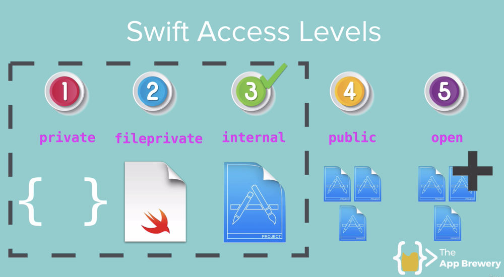

# iOS13 Calculator Advanced

Section 22: Advanced Swift Classroom - Part 2

## What you will practice

* Swift Access Levels

1. private: within the scope
2. fileprivate: within the file
3. internal: default, within the project(module)
4. public: between modules (ex. pod external module)
5. open: can be overwritten like public+

>This is a companion project to The App Brewery's Complete App Developement Bootcamp, check out the full course at [www.appbrewery.co](https://www.appbrewery.co/)

